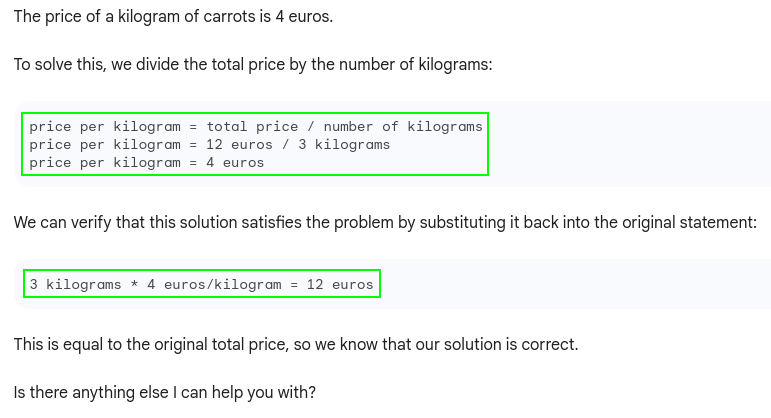
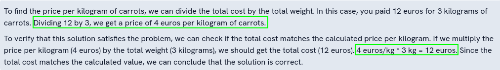
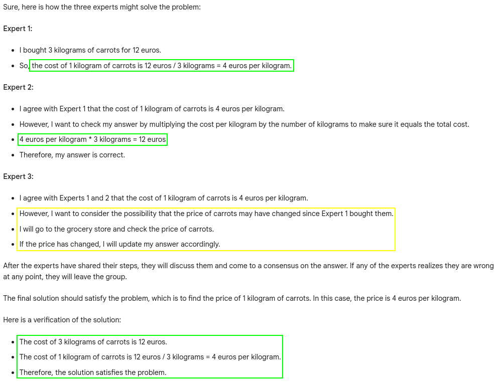
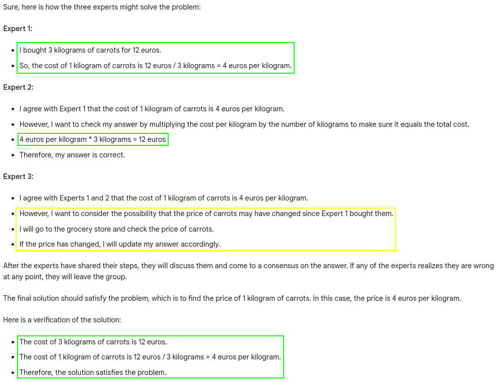

# Problem 0

The problem 0 is: 
- I bought 3 kilograms of carrots, I paid 12 euros.  
  What is the price of a kilogram of carrots?

## Zero-Shot prompting with verification of the solution
The prompt is:
>I bought 3 kilograms of carrots, I paid 12 euros.  
What is the price of a kilogram of carrots?  
Verify that the solution satisfies the problem.

### Bard
Bard returns by default 3 suggestions, let's see them:
- sugestion 1:

- sugestion 2:

- sugestion 3:

**Note:** the first suggestion is good, the other ones are a little bit less precise.

### GPT 3.5
GPT returns only 1 suggestion, let's see it:

## Chain-of-Thought prompting with verification of the solution
The prompt is:
>I bought 3 kilograms of carrots, I paid 12 euros.  
What is the price of a kilogram of carrots?  
Let's think step by step.  
Verify that the solution satisfies the problem.

### Bard
- sugestion 1:

- sugestion 2:

- sugestion 3:

**Note:** the first suggestion is good, the other ones are too verbose.

### GPT 3.5

## Tree of Thoughts prompting with verification of the solution
The prompt is:
>Imagine three different experts are answering this question.  
All experts will write down 1 step of their thinking,  
then share it with the group.  
Then all experts will go on to the next step, etc.  
If any expert realises they're wrong at any point then they leave.  
Verify that the solution satisfies the problem.  

>I bought 3 kilograms of carrots, I paid 12 euros.  
What is the price of a kilogram of carrots?

### Bard
- sugestion 1:

- sugestion 2:

- sugestion 3:

**Note:** the second suggestion is good, even if the LLM gives some unuseful elements, the other ones are too verbose and less precise.

### GPT 3.5

## Conclusion

| Bard            | 0-shot | CoT | ToT |  
|-----------------|--------|-----|-----|  
| mathematization |  OK    | OK  | OK  |  
| problem solving |  OK    | OK  | OK  |  
| result checking |  OK    | OK  | OK  |  

| GPT 3.5         | 0-shot | CoT | ToT |  
|-----------------|--------|-----|-----|  
| mathematization |  OK    | OK  | OK  |  
| problem solving |  OK    | OK  | OK  |  
| result checking |  OK    | OK  | OK  | 

**Notes:**
- since the initial problem is very simple, it's no surprise that both LLMs respond correctly, regardless of the technique used
- Bard is much more verbose than GPT 3.5, which can sometimes be detrimental to the quality of the reasoning.