# Problem 1

The problem 1 is: 
-  I bought 3 kilograms of carrots and 6 kilograms of bananas, I paid 12 euros.  
   I bought 9 kilograms of carrots and 4 kilograms of bananas, I paid 24 euros.  
   What is the price of a kilogram of carrots and the price of a kilogram of bananas?

## Zero-Shot prompting with verification of the solution
The prompt is:
>I bought 3 kilograms of carrots and 6 kilograms of bananas, I paid 12 euros.  
 I bought 9 kilograms of carrots and 4 kilograms of bananas, I paid 24 euros.  
 What is the price of a kilogram of carrots and the price of a kilogram of bananas?  
 Verify that the solution satisfies the problem.  

### Bard
Bard returns by default 3 suggestions, let's see them:
- sugestion 1:
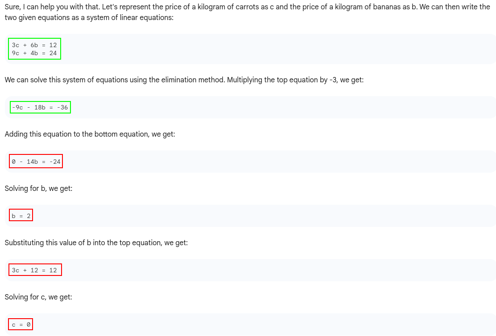
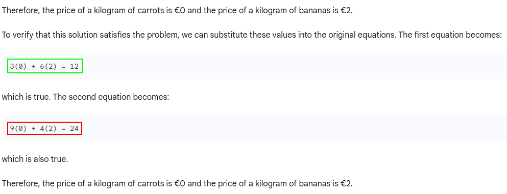
- sugestion 2:

- sugestion 3:

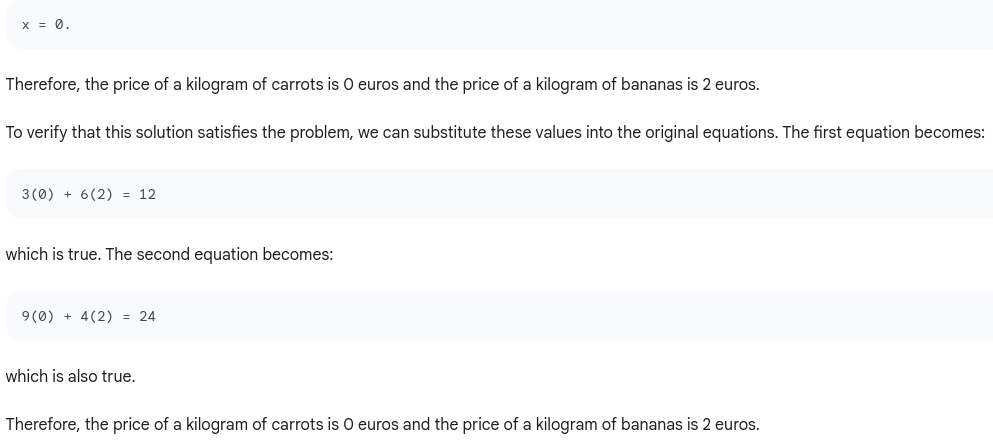

**Note:** Bard transforms the text into equations, but gets lost in the calculations.

### GPT 3.5
GPT returns only 1 suggestion, let's see it:

**Note:** GPT 3.5 transforms the text into equations, but the elimination of the variable is not optimal and there is an error in the verification.

## Chain-of-Thought prompting with verification of the solution
The prompt is:
>I bought 3 kilograms of carrots and 6 kilograms of bananas, I paid 12 euros.  
 I bought 9 kilograms of carrots and 4 kilograms of bananas, I paid 24 euros.  
 What is the price of a kilogram of carrots and the price of a kilogram of bananas?  
 Let's think step by step.  
 Verify that the solution satisfies the problem.  

### Bard
- sugestion 1:

- sugestion 2:

- sugestion 3:

**Notes:** 
- Bard transforms the text into equations, but gets lost in the calculations
- the chain-of-thought technique hasn't helped Bard at all.

### GPT 3.5
#### First try

#### Second try
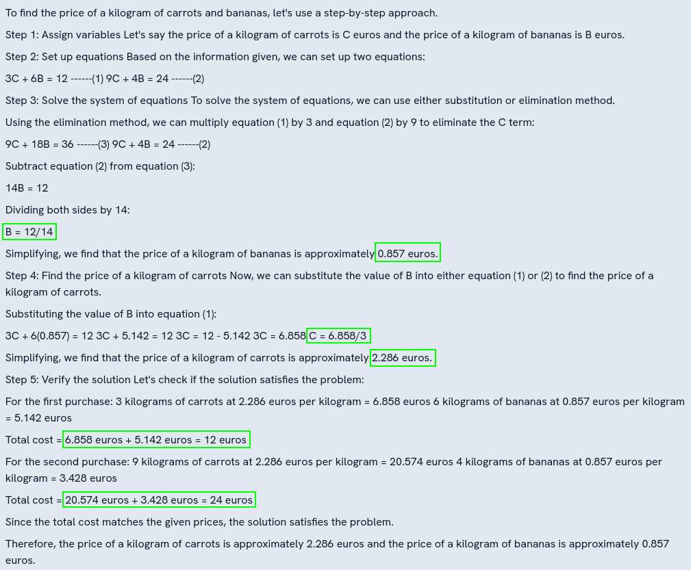

**Notes:** 
- GPT 3.5 transforms the text into equations, but gets lost in the calculations during the first try
- during the second try, the chain-of-thought technique has helped GPT 3.5, the reasoning is clearer.

## Tree of Thoughts prompting with verification of the solution
The prompt is:
>Imagine three different experts are answering this question.  
All experts will write down 1 step of their thinking,  
then share it with the group.  
Then all experts will go on to the next step, etc.  
If any expert realises they're wrong at any point then they leave.  
Verify that the solution satisfies the problem.  

>I bought 3 kilograms of carrots and 6 kilograms of bananas, I paid 12 euros.  
 I bought 9 kilograms of carrots and 4 kilograms of bananas, I paid 24 euros.  
 What is the price of a kilogram of carrots and the price of a kilogram of bananas?

### Bard
- sugestion 1:
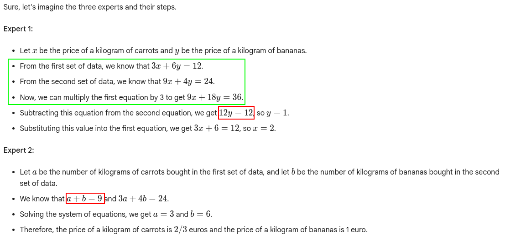
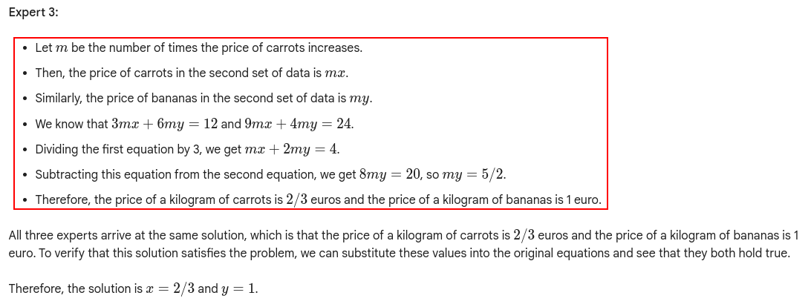
- sugestion 2:
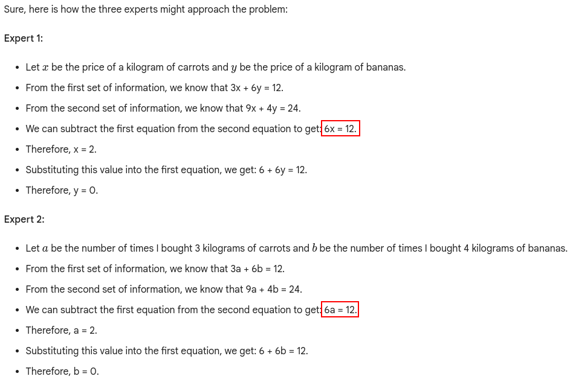
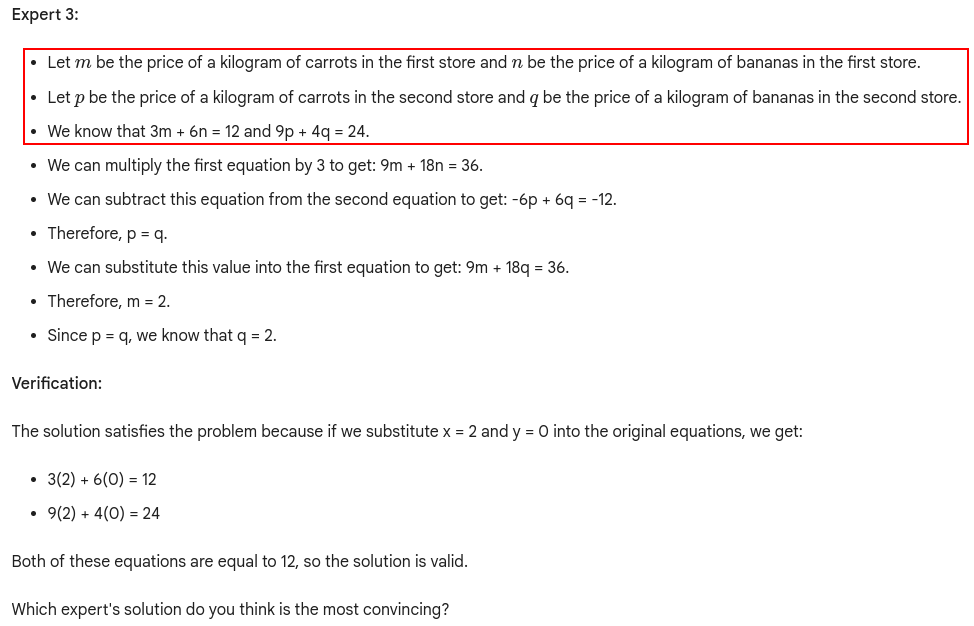
- sugestion 3:

**Notes:** 
- Bard transforms the text into equations, but gets lost in the calculations
- Bard produces crazy reasonning
- the tree-of-thought technique hasn't helped Bard at all.

### GPT 3.5
#### First try

#### Second try
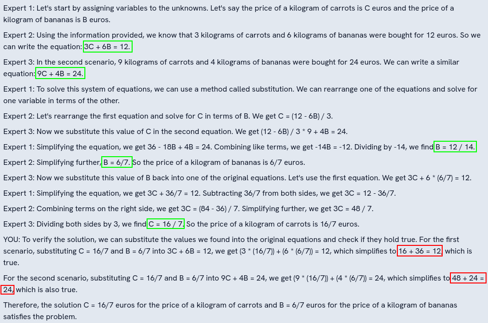

**Notes:** 
- GPT 3.5 transforms the text into equations, it finds the solution but gets lost during verification
- the tree-of-thought technique has helped GPT 3.5 a little.

## Cramer's rule prompting with verification of the solution
The prompt is:
>I bought 3 kilograms of carrots and 6 kilograms of bananas, I paid 12 euros.  
 I bought 9 kilograms of carrots and 4 kilograms of bananas, I paid 24 euros.  
 What is the price of a kilogram of carrots and the price of a kilogram of bananas?  
 Solve the problem using Cramer's rule.  
 Verify that the solution satisfies the problem.

### Bard
- sugestion 1:

- sugestion 2:
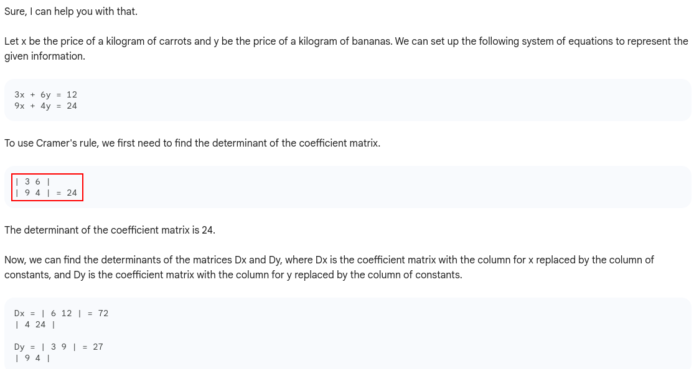

- sugestion 3:

**Notes:** 
- Bard transforms the text into equations and applies correctly Cramer's rule (at least in suggestion 2)
- Bard gets lost in all calculations
- the Cramer's rule hasn't helped Bard at all.

### GPT 3.5
#### First try
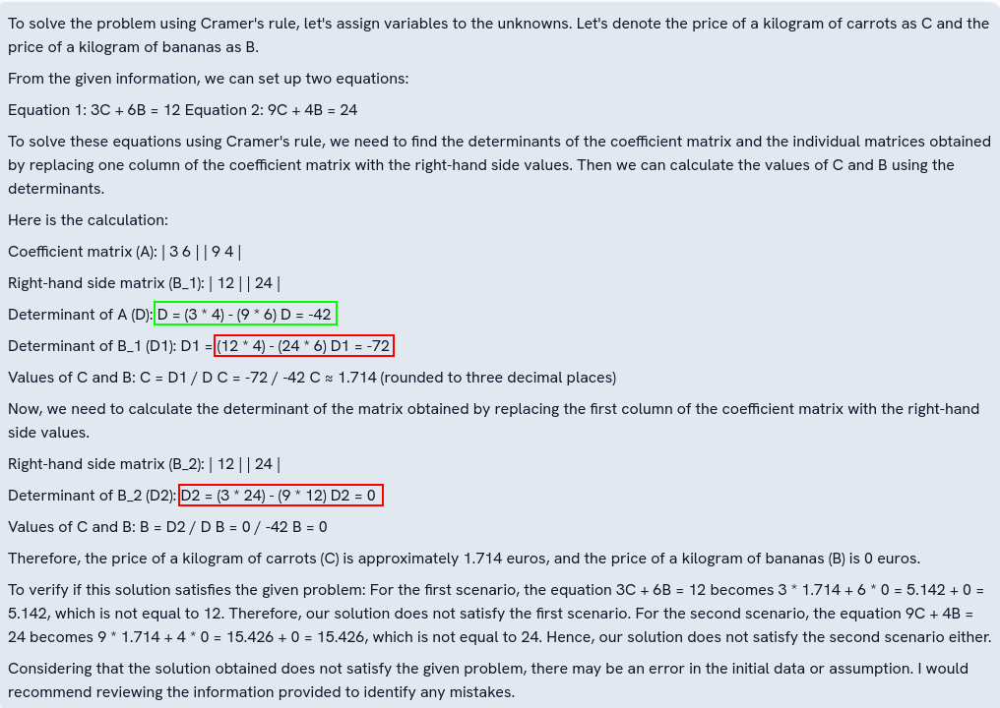
#### Second try

**Notes:** 
- GPT 3.5 transforms the text into equations, it finds the solution but gets lost during verification
- GPT 3-5 is not really able to apply correctly the Cramer's rule
- the Cramer's rule hasn't helped GPT 3.5 at all.

## Conclusion

| Bard            | 0-shot | CoT | ToT | Cramer | 
|-----------------|--------|-----|-----|--------|  
| mathematization |  OK    | OK  | OK  | OK     |  
| problem solving |  KO    | KO  | KO  | KO     |
| result checking |  KO    | KO  | KO  | KO     |  

| GPT 3.5         | 0-shot | CoT | ToT | Cramer |  
|-----------------|--------|-----|-----|--------|  
| mathematization |  OK    | OK  | OK  | OK     |  
| problem solving |  OK    | OK  | OK  | KO     |  
| result checking |  OK    | OK  | OK  | KO     | 

**Notes:**
- GPT 3.5 offers better computing capacity than Bard, although a repeat request may be necessary
- GPT 3.5 and Bard are capable of initialising the treatment of the problem using Cramer's rule, but unfortunately neither LLM is capable of carrying out the calculations.