# Problem 3

The problem 1 is: 
-  I bought 3 kilograms of carrots and 6 kilograms of bananas, I paid 12 euros.  
   I bought 9 kilograms of carrots and 18 kilograms of bananas, I paid 32 euros.  
   What is the price of a kilogram of carrots and the price of a kilogram of bananas?  

## Zero-Shot prompting with verification of the solution
The prompt is:
>I bought 3 kilograms of carrots and 6 kilograms of bananas, I paid 12 euros.  
 I bought 9 kilograms of carrots and 18 kilograms of bananas, I paid 32 euros.  
 What is the price of a kilogram of carrots and the price of a kilogram of bananas?  
 Verify that the solution satisfies the problem.  

### Bard
Bard returns by default 3 suggestions, let's see them:
- sugestion 1:
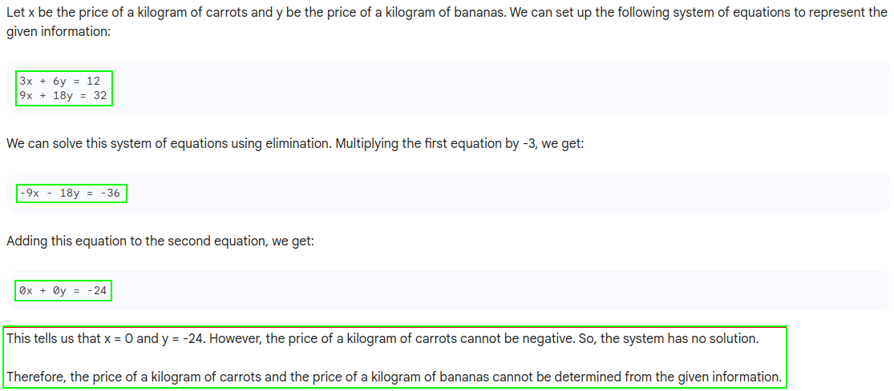
- sugestion 2:
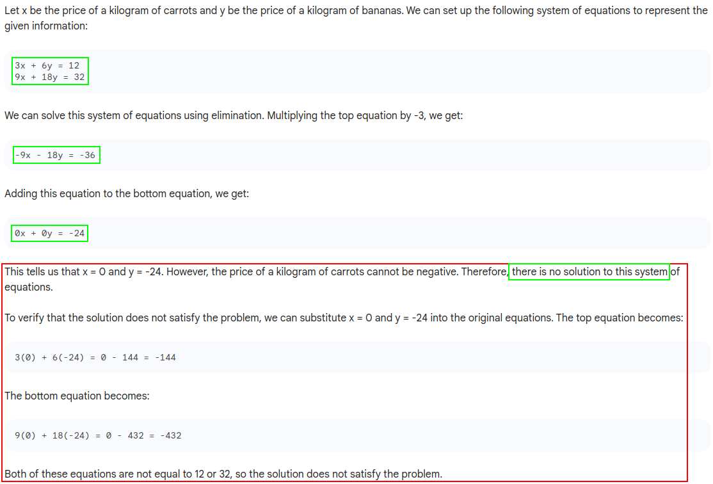
- sugestion 3:

### GPT 3.5
GPT returns only 1 suggestion, let's see it:

## Chain-of-Thought prompting with verification of the solution
The prompt is:
>I bought 3 kilograms of carrots and 6 kilograms of bananas, I paid 12 euros.  
 I bought 9 kilograms of carrots and 18 kilograms of bananas, I paid 32 euros.  
 What is the price of a kilogram of carrots and the price of a kilogram of bananas?   
 Let's think step by step.  
 Verify that the solution satisfies the problem.

### Bard
- sugestion 1:

- sugestion 2:
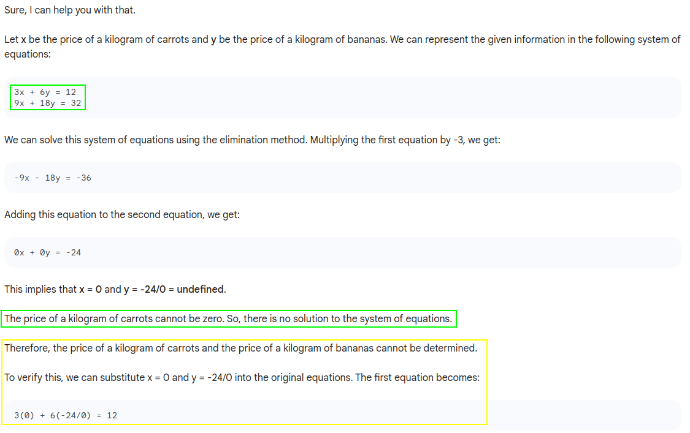

- sugestion 3:
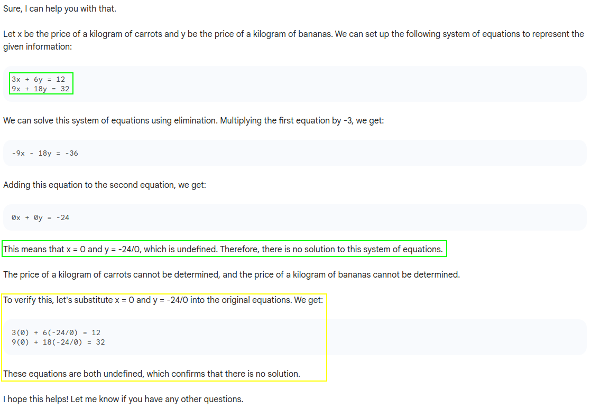

### GPT 3.5
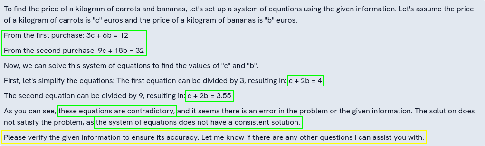

## Tree of Thoughts prompting with verification of the solution
The prompt is:
>Imagine three different experts are answering this question.  
All experts will write down 1 step of their thinking,  
then share it with the group.  
Then all experts will go on to the next step, etc.  
If any expert realises they're wrong at any point then they leave.  
Verify that the solution satisfies the problem.  

>I bought 3 kilograms of carrots and 6 kilograms of bananas, I paid 12 euros.  
 I bought 9 kilograms of carrots and 18 kilograms of bananas, I paid 32 euros.  
 What is the price of a kilogram of carrots and the price of a kilogram of bananas?  

### Bard
- sugestion 1:

- sugestion 2:
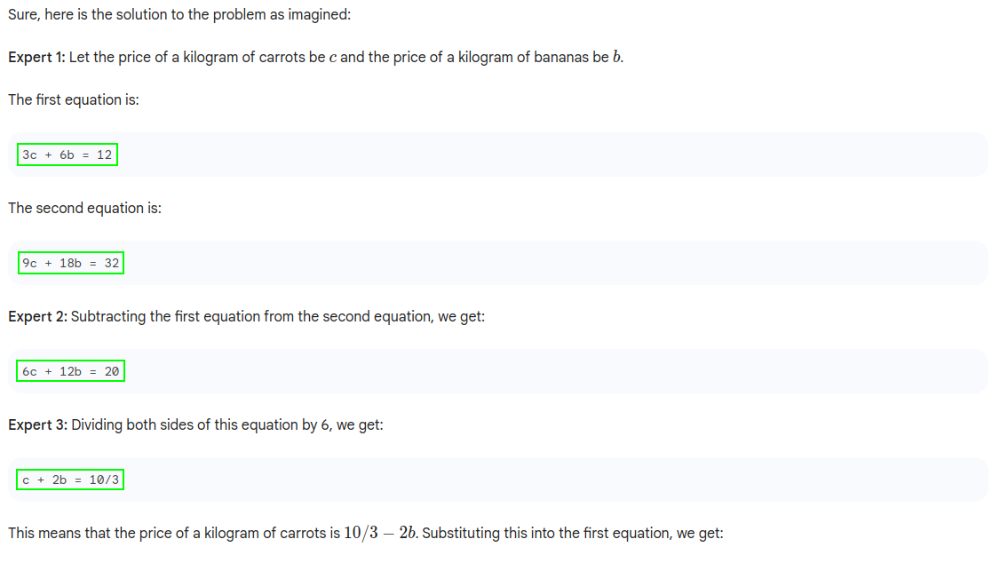
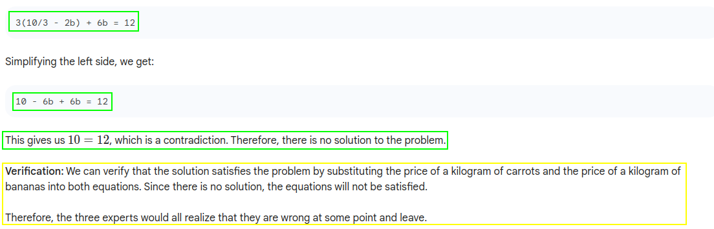
- sugestion 3:
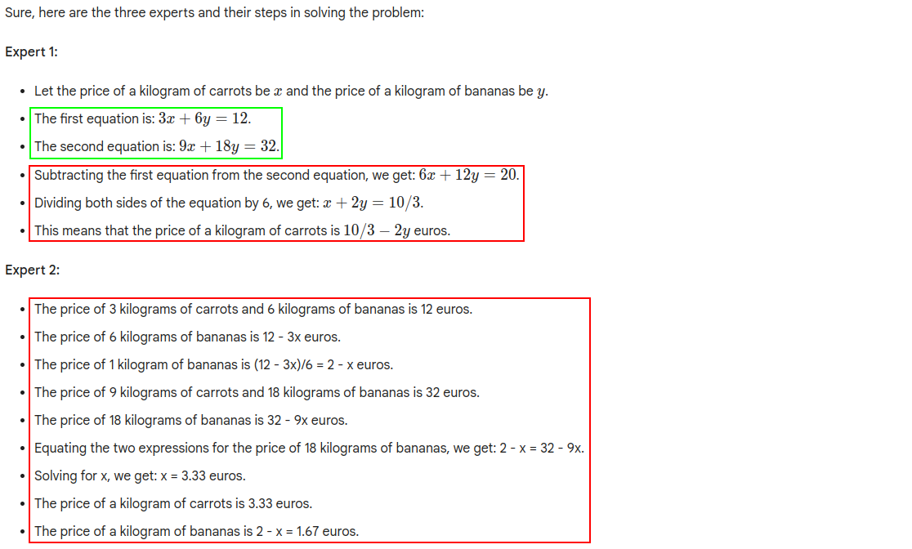

### GPT 3.5
#### First try

#### Second try
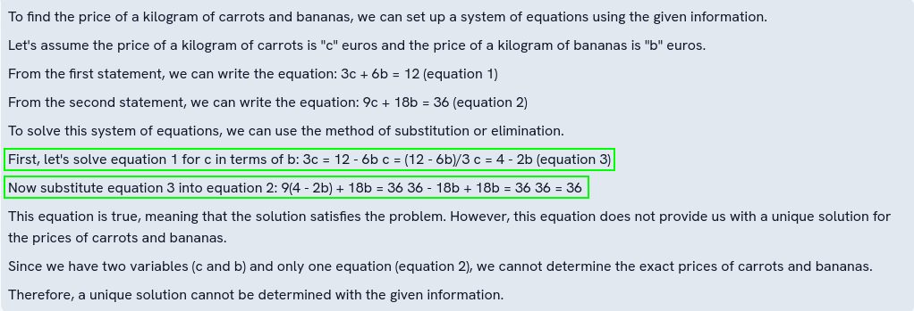

## Cramer's rule prompting with verification of the solution
The prompt is:
>I bought 3 kilograms of carrots and 6 kilograms of bananas, I paid 12 euros.  
I bought 9 kilograms of carrots and 18 kilograms of bananas, I paid 32 euros.  
What is the price of a kilogram of carrots and the price of a kilogram of bananas?  
Solve the problem using Cramer's rule.  
Verify that the solution satisfies the problem.  

### Bard
- sugestion 1:
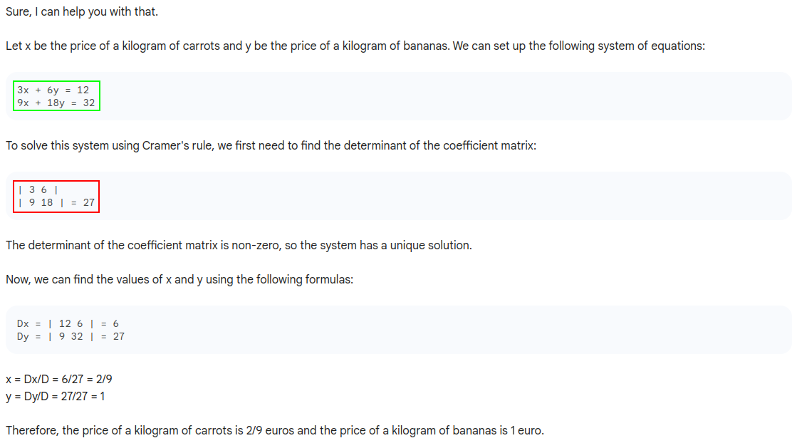

- sugestion 2:
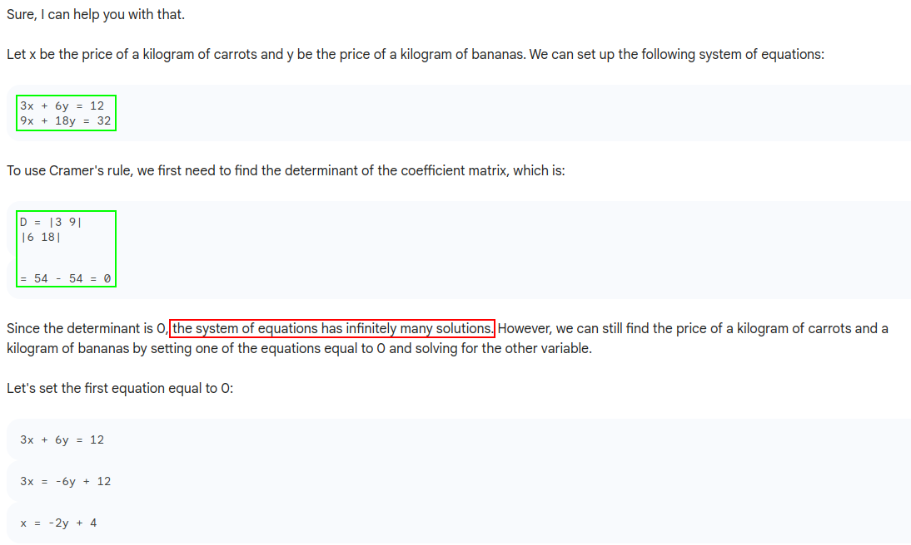

- sugestion 3:

### GPT 3.5

## Conclusion

| Bard            | 0-shot | CoT | ToT | Cramer | 
|-----------------|--------|-----|-----|--------|  
| mathematization |  OK    | OK  | OK  | OK     |  
| problem solving |  KO    | OK  | OK  | KO     |
| result checking |  KO    | OK  | OK  | KO     |  

| GPT 3.5         | 0-shot | CoT | ToT | Cramer |  
|-----------------|--------|-----|-----|--------|  
| mathematization |  OK    | OK  | OK  | OK     |  
| problem solving |  OK    | OK  | OK  | OK     |  
| result checking |  OK    | OK  | OK  | OK     | 

**Note:**
- Bard (with 0-shot techniques) makes a big mistake, it finds that $0x+0y=24$ and concludes that $x=0$ and $y=-24$ ; with chain-of thought technique, it returns $y=\frac{-24}{0}$...
- GPT 3.5 and Bard are capable of initialising the treatment of the problem using Cramer's rule. Only LLM GPT 3.5 detects the nullity of the determinant and correctly concludes. 